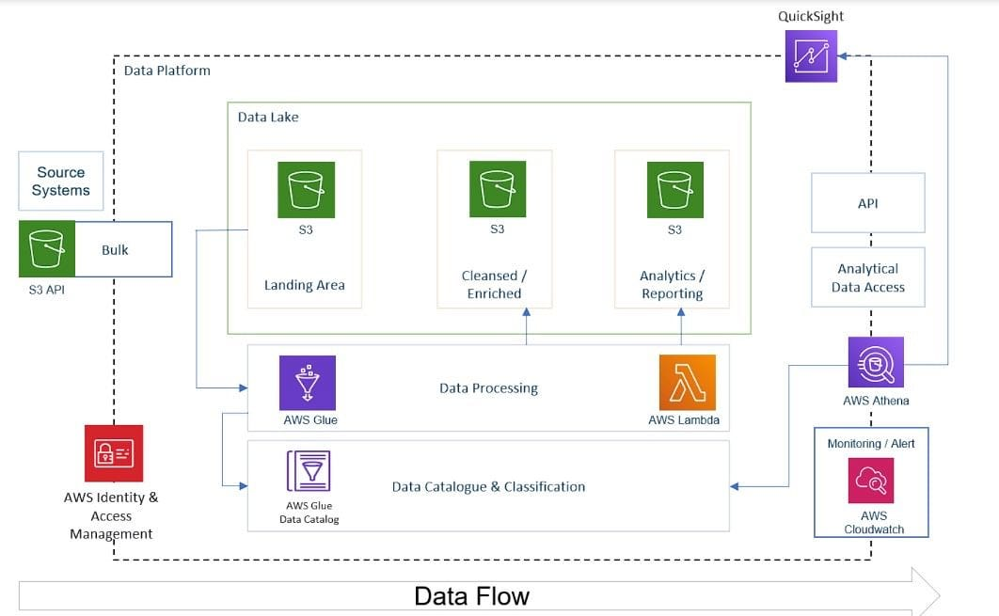

# YouTube Data Analytics using AWS

 

## Project Overview

The projects aims to build a secure and streamlined data engineering pipeline on AWS, leveraging services like S3, IAM, Glue, Athena QuickSight, and Lambda for comprehensive analysis of structured and semi-structured YouTube data based on video categories and trending metrics.

## Real-Life Scenario Use-Case:
- The requirement from our potential customer is: To launch a new data driven campaign and their main advertising channel is YouTube.
- Before actually investing in this campaign they want to understand certain parameters like - what factors influence how popular a YouTube video will be or how to categorise videos based on their comments/statistics. This can help them target the right audience.
- As a data scientist, you are required to build an end to end pipeline which ingest data from multiple sources, transform this data into the proper format and build a dashboard to analyze and give a visual display of key performance indicators (KPIs).
- The success of the project depends on following parameters:

    - Data Ingestion: Develop a mechanism to gather data from various origins.
    - ETL System: Convert raw data into the appropriate format.
    - Data Lake: Create a centralized repository to store data collected from multiple sources.
    - Scalability: Ensure the system can handle larger data volumes as they increase.
    - Cloud: Utilize AWS for processing extensive amounts of data since local computers are insufficient.
    - Reporting: Construct a interactive dashboard to obtain answers.

## Dataset Used
- The [Kaggle dataset](https://www.kaggle.com/datasets/datasnaek/youtube-new) used in this project contains statistics (CSV files) on daily trending YouTube videos over the course of many months. There are up to 200 trending videos published every day for many locations. 
- Each region’s data is in a separate file. Data includes the video title, channel title, publish time, tags, views, likes and dislikes, description, and comment count.
The data for each region is in its own file. The video title, channel title, publication time, tags, views, likes and dislikes, description, and comment count are among the items included in the data. The data also includes a category_id field, which varies between regions. To retrieve the categories for a specific video, find it in the associated JSON file.
- Two data files:

    - Region - contains video information from different regions
    - Category - contains information about different categories of videos

## AWS Services used in Project
- __IAM (Identity and Access Management)__: AWS IAM allows you to manage user access and permissions for AWS resources. You can create and manage users, groups, and roles, and define fine-grained permissions using IAM policies.

- __S3 (Simple Storage Service)__: Amazon S3 is a scalable and durable object storage service. It provides secure, highly available, and cost-effective storage for various types of data, such as files, images, videos, and backups.

- __Glue__: AWS Glue is a fully managed extract, transform, and load (ETL) service. It helps in preparing and transforming data for analytics, data lakes, and machine learning. Glue automates the process of discovering, cataloging, and cleaning data from various sources.

- __Athena__: AWS Athena is an interactive query service that allows you to analyze data directly from various data sources using standard SQL queries. It is serverless and enables ad-hoc analysis on data stored in Amazon S3, making it easy to gain insights without the need for infrastructure management.

- __Lambda__: AWS Lambda is a serverless compute service that allows you to run code without provisioning or managing servers. It executes your code in response to events, such as changes to data, API requests, or scheduled tasks, providing a scalable and cost-efficient way to execute code.

- __QuickSight__: Amazon QuickSight is a cloud-native business intelligence service that enables you to create interactive visualizations, reports, and dashboards from a wide variety of data sources. It allows you to easily explore and gain insights from your data using built-in visualization capabilities and machine learning-driven insights.

## Project Workflow

- Create an IAM user 
- Configure aws cli with your IAM user credentials
- Create an Amazon S3 Bucket and move all the data to S3
- Now we need to build a AWS Glue Data Catalog that serves as a central metadata repository. (organizes metadata information about data sources, tables, schemas, and transformations). AWS Glue crawler is used to automatically scan and infer the schema of data stored in S3 bucket and create a metadata table in our data catalog. 
- Make sure to create an IAM role for this so that AWS Glue can interact with S3. 
- Before that we will run a python script inside AWS Lambda to convert semi-structured data (json files) into structured format (apache parquet) and store this cleansed version of data into S3. Make sure to create the IAM role for the same.
- Now we will build a glue catalog around this cleaned and transformed data in parquet format. Use AWS Athena to make SQL queries on this data stored in Amazon S3.
- Now build a csv crawler to build a catalog for data in csv files partitioned by region name.
- Build a ETL job in pyspark (generated by AWS itself) to convert all the csv data into parquet format. 
- Then again a data catalog for this cleaned data.
- Add the S3 Trigger to our lambda function so that whenever new data is added, the results are automatically written.
- Create a job to save the results of inner join query on the tables in S3.
- Use quicksight to make dashboards.

